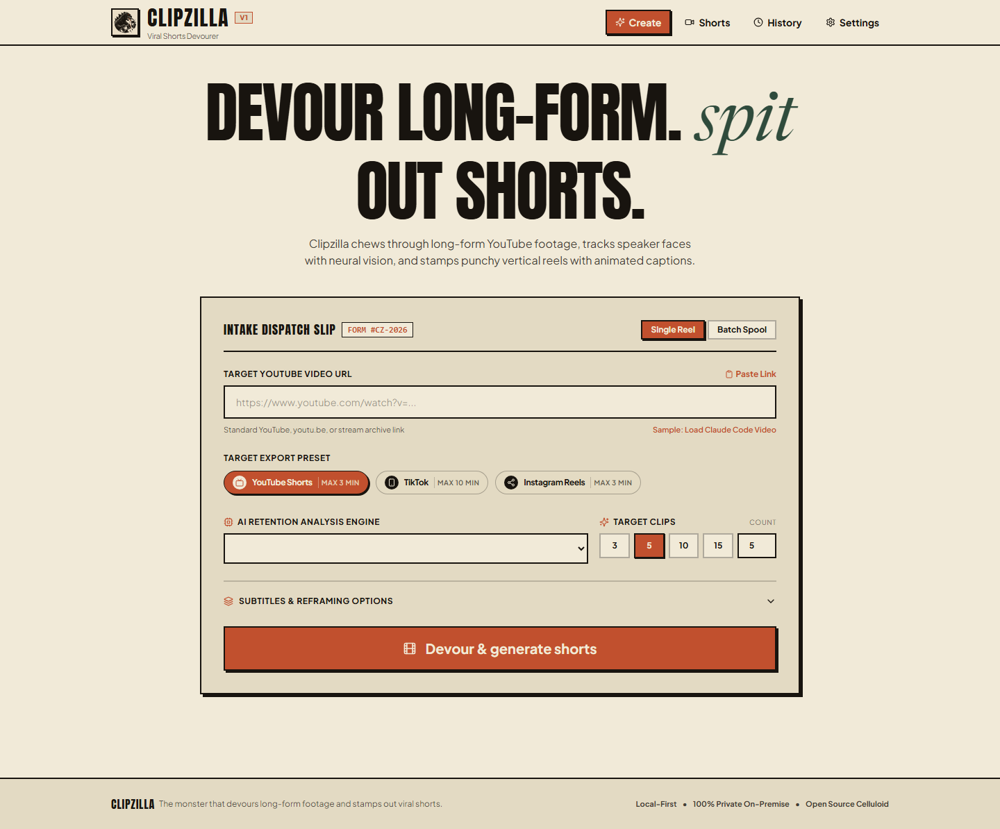
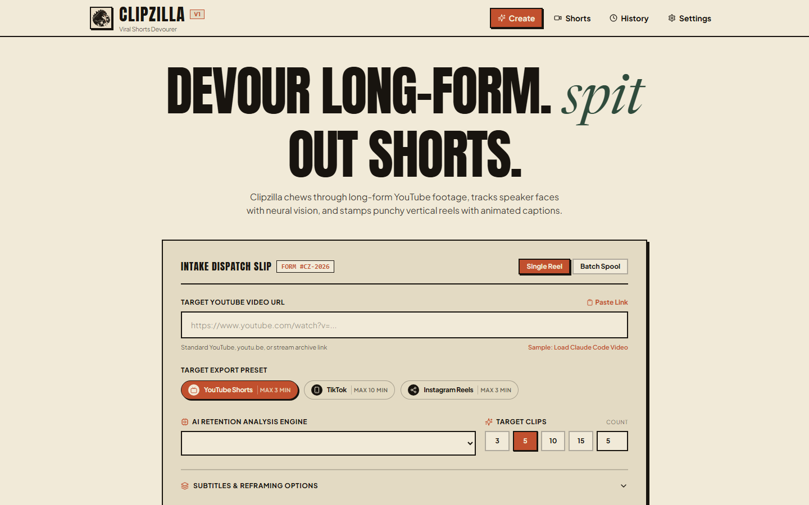

<p align="center">
  
</p>

<h1 align="center">Clipzilla</h1>

<p align="center">
  <strong>🦖 Monster that devours long-form and spits out shorts.</strong>
</p>

<p align="center">
  <a href="#features">Features</a> •
  <a href="#screenshots">Screenshots</a> •
  <a href="#getting-started">Getting Started</a> •
  <a href="#usage">Usage</a> •
  <a href="#web-ui">Web UI</a> •
  <a href="#configuration">Configuration</a> •
  <a href="#architecture">Architecture</a> •
  <a href="#api-reference">API Reference</a> •
  <a href="#testing">Testing</a> •
  <a href="#license">License</a>
</p>

<p align="center">
  
  
  
  
  
  
</p>

---

Clipzilla is an open-source, local-first tool that converts long YouTube videos into viral vertical shorts (1080×1920) with **AI-powered speaker face tracking** and **animated word-highlighted subtitles**. It includes both a sleek retro-themed **Web UI** and a powerful **CLI**.

Designed for efficiency and simplicity, Clipzilla runs comfortably on modest hardware (**8 GB RAM, no GPU required**) by streaming media directly through FFmpeg subprocesses, running `faster-whisper` with `int8` quantization, tracking speaker faces with lightweight MediaPipe, and using interchangeable LLM providers (Ollama Local, Ollama Cloud, or any OpenAI-compatible API) to automatically discover high-retention moments and produce ready-to-post vertical shorts.

---

## Screenshots

<p align="center">
  
</p>

<p align="center"><em>Clipzilla's retro celluloid-themed Web UI — paste a YouTube link, pick your platform, and let the monster devour.</em></p>

<p align="center">
  
</p>

<p align="center"><em>Above-the-fold hero with intake dispatch slip, export presets for YouTube Shorts / TikTok / Instagram Reels, and AI retention engine selector.</em></p>

---

## Features

### 🎬 Core Pipeline
- **Smart Downloads** — Downloads YouTube videos capped at 1080p using `yt-dlp`, fetching audio and auto-generated/manual captions into organized `./workdir/<video_id>/` workspaces.
- **Unified Word-Level Transcripts** — Automatically converts existing YouTube captions into word-level JSON transcripts without extra compute. Falls back to `faster-whisper` (CTranslate2 backend, `int8` quantization on CPU, auto-detects GPU). Use `--force-whisper` to always run Whisper.
- **Intelligent Clip Analysis** — Leverages interchangeable LLM providers to detect 3–8 self-contained, high-retention moments with strong hooks. Strict Pydantic JSON schema validation with an automatic 2-attempt error correction feedback loop. Independent heuristic scoring flags clips that start or end mid-sentence.
- **Smart Face-Tracking Reframe** — Samples video frames every 0.5s and tracks primary speaker face position using MediaPipe. Exponential moving average (EMA) smoothing with deadband dampening eliminates jittery camera movement. Generates 1080×1920 vertical crops keeping the speaker centered. If no face is detected (gameplay, tutorials, slides), automatically applies a blurred background fill.
- **Animated Caption Presets** — **Karaoke**: 3–5 word lines with progressive word illumination. **Single-word**: Punchy bold pop-up with scale zoom animation. Configurable font, highlight color, and screen position.
- **One-Click Auto Pipeline** — Chains download → transcribe → analyze → reframe → caption → export with a single command. Atomic & resumable: uses `.tmp.mp4` files to avoid corrupt clips on interruption.

### 🌐 Web UI
- **React + Vite + Tailwind CSS** frontend with a unique retro celluloid/poster design system.
- **480p Proxy Ingest** — Automatically encodes a lightweight 480p proxy for zero-lag in-browser scrubbing.
- **Interactive Timeline Editor** — Draggable trim handles, inline caption text editing, crop-focus track with overrides (Auto AI, Center, Left, Right, Blurred Fill, Manual Drag).
- **Draggable 9:16 Crop Box** — Directly reposition the crop rectangle over the 16:9 canvas.
- **Typography Studio** — 9 viral font families, 4 size presets, 7 highlight colors, text transforms, and animation style selectors.
- **Selective Re-rendering** — Re-crops, re-captions, and re-exports only modified shorts from the 1080p source without re-running transcription or analysis.
- **Batch Processing** — Submit multiple YouTube URLs at once and monitor progress.
- **History & Vault** — Browse all previously generated shorts with filtering, search, and inline editing.

### 🔧 Platform Export Presets
| Platform | Aspect Ratio | Max Duration | Video Bitrate | Audio Bitrate |
|---|---|---|---|---|
| YouTube Shorts | 9:16 | 3 min | 10 Mbps | 192 kbps |
| TikTok | 9:16 | 10 min | 12 Mbps | 192 kbps |
| Instagram Reels | 9:16 | 3 min | 8 Mbps | 192 kbps |

### 🤖 LLM Provider Support
- **Ollama Local** — Free, 100% private, runs on your machine.
- **Ollama Cloud** — Cloud-hosted Ollama with API key.
- **OpenAI-Compatible** — Groq, OpenRouter, LM Studio, vLLM, DeepSeek, and any `/v1/chat/completions` endpoint.

---

## Getting Started

### Prerequisites

| Requirement | Version | Notes |
|---|---|---|
| **Python** | 3.11+ | Required |
| **Node.js** | 18+ | For the Web UI |
| **FFmpeg** | Any recent | Must be in your system `PATH`, compiled with `--enable-libass` |
| **LLM Provider** | *(Optional)* | Ollama, Groq, OpenRouter, etc. for AI clip analysis |

Verify FFmpeg is installed:
```bash
ffmpeg -version
```

### Installation

#### 1. Clone the repository
```bash
git clone https://github.com/UmarIqbal000/Clipzilla.git
cd Clipzilla
```

#### 2. Set up the Python environment

**Using `uv` (recommended):**
```bash
uv venv --python 3.11 .venv

# Windows (PowerShell)
.\.venv\Scripts\activate

# Linux / macOS
source .venv/bin/activate
```

**Using standard `venv`:**
```bash
python3.11 -m venv .venv

# Windows (PowerShell)
.\.venv\Scripts\activate

# Linux / macOS
source .venv/bin/activate
```

#### 3. Install Python dependencies
```bash
pip install -e .
```

Or using `requirements.txt`:
```bash
pip install -r requirements.txt && pip install -e .
```

#### 4. Install Web UI dependencies
```bash
cd web
npm install
cd ..
```

#### 5. Configure your LLM provider
```bash
# Copy the example config
cp config.yaml.example config.yaml
```

Edit `config.yaml` to set up your preferred LLM backend (see [Configuration](#configuration) below).

---

## Starting the Application

### 🚀 Full-Stack (Recommended)

Run both the FastAPI backend and React frontend with a single command:

```bash
python dev.py
```

This starts:
| Service | URL | Description |
|---|---|---|
| **React Web UI** | [http://localhost:5173](http://localhost:5173) | Main web interface |
| **FastAPI Backend** | [http://localhost:8000](http://localhost:8000) | REST API server |
| **Swagger Docs** | [http://localhost:8000/docs](http://localhost:8000/docs) | Interactive API documentation |

Open [http://localhost:5173](http://localhost:5173) in your browser and you're ready to go!

Press `Ctrl+C` to stop all services.

### Running Services Independently

If you prefer to run the backend and frontend separately:

**Terminal 1 — Backend:**
```bash
# Set PYTHONPATH to include the src directory
# Windows (PowerShell)
$env:PYTHONPATH = "src"
uvicorn clipzilla.api.app:app --reload --host 127.0.0.1 --port 8000

# Linux / macOS
PYTHONPATH=src uvicorn clipzilla.api.app:app --reload --host 127.0.0.1 --port 8000
```

**Terminal 2 — Frontend:**
```bash
cd web
npm run dev
```

### Building for Production

```bash
cd web
npm run build
```

The built static files in `web/dist/` will be automatically served by the FastAPI backend.

---

## Usage

### 🌐 Web UI Workflow

1. **Open** [http://localhost:5173](http://localhost:5173)
2. **Paste** a YouTube URL (or switch to Batch Spool for multiple URLs)
3. **Choose** your target platform (YouTube Shorts, TikTok, or Instagram Reels)
4. **Select** an AI retention analysis engine (or leave default)
5. **Set** target clip count (3, 5, 10, 15, or custom)
6. **Click** "Devour & generate shorts"
7. **Monitor** the 4-stage pipeline: Ingest → Transcribe → Analyze → Render
8. **Browse** generated shorts in the Shorts vault
9. **Edit** any short in the Timeline Editor — trim, restyle captions, adjust framing
10. **Re-render** and download your polished vertical reels

### 🖥️ CLI Workflow

#### The One-Click Way (`clipzilla auto`)

Run the entire end-to-end pipeline with a single command:
```bash
clipzilla auto "https://www.youtube.com/watch?v=x7X9w_GIm1s"
```

Customize reframing and subtitle animation:
```bash
clipzilla auto "https://www.youtube.com/watch?v=x7X9w_GIm1s" \
  --preset single \
  --color cyan \
  --reframe auto
```

Outputs are exported to `./output/` (or custom `-o / --output-dir`). The original source video is automatically deleted after clips are generated to conserve disk space (use `--keep-source` to retain it). If interrupted, simply rerun — finished stages and clips are safely resumed!

#### Step-by-Step Commands

**1. Download Video**
```bash
clipzilla download "https://www.youtube.com/watch?v=x7X9w_GIm1s"
```
Downloads the video capped at 1080p and all available subtitles to `./workdir/<video_id>/`.

**2. Transcribe**
```bash
clipzilla transcribe
```
Converts downloaded captions or runs `faster-whisper` (`int8` quantization) to produce word-level timestamps in `transcript.json`.

Use `--force-whisper` to run Whisper even when YouTube captions exist.

**3. Analyze for High-Retention Clips**
```bash
clipzilla analyze
```
Prompts the LLM to identify 3–8 viral moments, runs heuristic boundary trimming checks, and saves suggestions to `clips_suggested.json`.

**4. Cut a Custom Short**
```bash
# Karaoke highlight (default)
clipzilla clip --start 5 --end 25

# Single-word pop-up with cyan highlight
clipzilla clip --start 10 --end 30 --preset single --color cyan

# Blurred background fill (ideal for gameplay or tutorials)
clipzilla clip --start 10 --end 30 --reframe blur

# Custom output file
clipzilla clip x7X9w_GIm1s --start 00:00:10 --end 00:00:40 --output shorts/my_short.mp4
```

---

## Web UI

### Screens

| Screen | Path | Description |
|---|---|---|
| **Create** | `/` or `/home` | Intake dispatch — submit YouTube URLs and configure pipeline options |
| **Shorts Vault** | `/shorts` | Master library of all generated vertical shorts across all jobs |
| **History** | `/history` | Archive of all processing jobs with status, filtering, and search |
| **Batch Detail** | `/batch/:id` | Detailed view of shorts generated from a specific video |
| **Timeline Editor** | `/editor` | Professional clip editor with trim, caption, crop, and style controls |
| **Settings** | `/settings` | AI provider engine management and profile configuration |

### Design System

Clipzilla's Web UI features a unique **retro celluloid / creature-feature poster** design language:

- **Palette**: Warm cream paper (`#F1EAD8`), deep ink black (`#18140F`), rust CTA (`#C1502E`), creature moss (`#2F4B3C`)
- **Typography**: Anton & Bebas Neue (headlines), Newsreader Italic (accents), Plus Jakarta Sans (body)
- **Interactions**: Hard offset retro shadows, camera shutter snap animations, celluloid reel spinners, film sprocket borders

---

## Configuration

### `config.yaml`

Copy `config.yaml.example` to `config.yaml` to get started:

```bash
cp config.yaml.example config.yaml
```

### LLM Provider Options

#### Option A: Ollama Local (Free, 100% Private — Default)

1. Download and install Ollama from [ollama.com](https://ollama.com).
2. Pull and run your preferred model:
   ```bash
   ollama run llama3.2
   ```
3. In `config.yaml`:
   ```yaml
   provider: ollama_local
   providers:
     ollama_local:
       base_url: "http://localhost:11434/v1"
       model: "llama3.2"
   ```

#### Option B: Ollama Cloud

1. Sign in at [ollama.com](https://ollama.com) and generate an API key.
2. Set the environment variable:
   ```bash
   # Windows (PowerShell)
   $env:OLLAMA_API_KEY = "your_api_key_here"

   # Linux / macOS
   export OLLAMA_API_KEY="your_api_key_here"
   ```
3. In `config.yaml`:
   ```yaml
   provider: ollama_cloud
   providers:
     ollama_cloud:
       base_url: "https://ollama.com/v1"
       api_key_env: "OLLAMA_API_KEY"
       model: "llama3.2"
   ```

#### Option C: OpenAI-Compatible Endpoints (Groq, OpenRouter, LM Studio, DeepSeek)

```yaml
provider: openai_compat
providers:
  openai_compat:
    base_url: "https://api.groq.com/openai/v1"
    api_key_env: "GROQ_API_KEY"
    model: "llama-3.3-70b-versatile"
```

**Other examples:**

<details>
<summary>OpenRouter</summary>

```yaml
provider: openai_compat
providers:
  openai_compat:
    base_url: "https://openrouter.ai/api/v1"
    api_key_env: "OPENROUTER_API_KEY"
    model: "meta-llama/llama-3.2-3b-instruct"
```
</details>

<details>
<summary>LM Studio (Local)</summary>

```yaml
provider: openai_compat
providers:
  openai_compat:
    base_url: "http://localhost:1234/v1"
    model: "local-model"
```
</details>

### Environment Variables

API keys can be stored in a `.env` file at the project root. The format is:
```env
OLLAMA_API_KEY=your_key_here
GROQ_API_KEY=your_key_here
```

When using the Web UI Settings page, API keys are automatically stored in `.env` with the naming convention `PROFILE_<ID>_KEY`.

### Other Configuration Options

| Key | Default | Description |
|---|---|---|
| `output_dir` | `output` | Default directory for exported shorts |
| `delete_source` | `true` | Delete the original downloaded video after clips are generated |

---

## Architecture

### High-Level Overview

```
┌─────────────────────────────────────────────────────────┐
│                     Clipzilla                           │
│                                                         │
│  ┌──────────────┐    ┌──────────────┐                   │
│  │   CLI (Click) │    │  Web UI      │                   │
│  │              │    │  React+Vite  │                   │
│  └──────┬───────┘    └──────┬───────┘                   │
│         │                   │                           │
│         │         ┌─────────▼────────┐                  │
│         │         │ FastAPI REST API │                  │
│         │         │   + Worker       │                  │
│         │         └─────────┬────────┘                  │
│         │                   │                           │
│  ┌──────▼───────────────────▼───────────┐               │
│  │         Core Pipeline Modules         │               │
│  │                                       │               │
│  │  ┌────────────┐  ┌──────────────┐     │               │
│  │  │ Downloader │→ │ Transcriber  │     │               │
│  │  │  (yt-dlp)  │  │(faster-whis.)│     │               │
│  │  └────────────┘  └──────┬───────┘     │               │
│  │                         │             │               │
│  │  ┌────────────┐  ┌──────▼───────┐     │               │
│  │  │ Heuristics │← │  Analyzer    │     │               │
│  │  │            │  │  (LLM)       │     │               │
│  │  └────────────┘  └──────┬───────┘     │               │
│  │                         │             │               │
│  │  ┌────────────┐  ┌──────▼───────┐     │               │
│  │  │ Subtitles  │← │  Reframe     │     │               │
│  │  │  (.ass)    │  │ (MediaPipe)  │     │               │
│  │  └─────┬──────┘  └──────┬───────┘     │               │
│  │        │                │             │               │
│  │        └───────┬────────┘             │               │
│  │         ┌──────▼───────┐              │               │
│  │         │   Clipper    │              │               │
│  │         │  (FFmpeg)    │              │               │
│  │         └──────────────┘              │               │
│  └───────────────────────────────────────┘               │
└─────────────────────────────────────────────────────────┘
```

### Pipeline Stages

| Stage | Module | Technology | Description |
|---|---|---|---|
| **1. Download** | `downloader.py` | yt-dlp | Fetches video (≤1080p), captions, metadata; generates 480p proxy |
| **2. Transcribe** | `transcriber.py`, `captions.py` | faster-whisper, WebVTT | Produces word-level `transcript.json` from captions or Whisper |
| **3. Analyze** | `analyzer.py`, `heuristics.py` | LLM + Pydantic | Discovers high-retention clips; validates with schema + boundary heuristics |
| **4. Reframe** | `reframe.py` | MediaPipe, OpenCV | Tracks speaker face; applies EMA smoothing; generates 9:16 crop path |
| **5. Caption** | `subtitles.py` | ASS format | Generates animated `.ass` subtitles (karaoke or single-word presets) |
| **6. Export** | `clipper.py` | FFmpeg | Burns subtitles, applies crop/blur, encodes `libx264`+`aac`, atomic writes |

### Project Structure

```
Clipzilla/
├── src/clipzilla/                 # Python backend package
│   ├── __init__.py                # Package metadata (v0.1.0)
│   ├── cli.py                     # Click-based CLI commands
│   ├── downloader.py              # YouTube video download + proxy generation
│   ├── transcriber.py             # Whisper transcription + caption conversion
│   ├── captions.py                # WebVTT/SRT parser → word-level timestamps
│   ├── analyzer.py                # LLM-powered clip discovery with Pydantic validation
│   ├── heuristics.py              # Sentence boundary scoring & trim suggestions
│   ├── reframe.py                 # MediaPipe face tracking + EMA smoothing + FFmpeg filters
│   ├── subtitles.py               # ASS subtitle generation (karaoke & single-word)
│   ├── clipper.py                 # FFmpeg clip cutting + subtitle burning
│   ├── schema.py                  # Pydantic models for clip validation
│   ├── config.py                  # YAML config loader + hardware detection
│   ├── presets.py                 # Platform export presets (YT Shorts, TikTok, Reels)
│   ├── api/                       # FastAPI REST API
│   │   ├── app.py                 # Routes, endpoints, static file serving
│   │   ├── worker.py              # Background job processing (producer-consumer queue)
│   │   ├── database.py            # SQLite storage for jobs, clips, history
│   │   └── settings.py            # Settings & profile CRUD, secret masking
│   └── llm/                       # LLM provider abstraction
│       ├── __init__.py            # Provider factory
│       ├── base.py                # Abstract base class + exceptions
│       └── providers.py           # Ollama Local/Cloud, OpenAI-compatible implementations
├── web/                           # React frontend
│   ├── src/
│   │   ├── App.jsx                # Root router + global state + job polling
│   │   ├── main.jsx               # React DOM mount
│   │   ├── index.css              # Tailwind directives + retro theme CSS
│   │   ├── api/client.js          # HTTP client with fallback + error handling
│   │   └── components/
│   │       ├── HomeScreen.jsx     # Video intake form + pipeline progress
│   │       ├── EditorScreen.jsx   # Timeline editor + typography studio
│   │       ├── ResultsScreen.jsx  # Shorts vault + inline editor drawer
│   │       ├── HistoryScreen.jsx  # Job archive + search + filtering
│   │       ├── BatchDetailScreen.jsx  # Single batch detail view
│   │       ├── SettingsScreen.jsx # AI provider engine management
│   │       ├── Navbar.jsx         # Global navigation bar
│   │       ├── MarqueeTicker.jsx  # Scrolling celluloid ticker tape
│   │       ├── PillBadge.jsx      # Reusable pill/badge component
│   │       ├── StatBlockRow.jsx   # Metric statistics banner
│   │       └── TopAnnouncementStrip.jsx  # Top announcement ribbon
│   ├── public/                    # Static assets (logo, favicon)
│   ├── index.html                 # HTML entry with Google Fonts
│   ├── vite.config.js             # Vite config with API proxy
│   ├── tailwind.config.js         # Custom design tokens & animations
│   └── package.json               # Frontend dependencies
├── tests/                         # Test suite
│   ├── conftest.py                # Shared fixtures
│   ├── test_reframe.py            # Face tracking tests
│   ├── test_captions.py           # Caption parsing tests
│   ├── test_cli.py                # CLI command tests
│   ├── test_llm_providers.py      # LLM provider tests
│   ├── test_heuristics.py         # Boundary heuristic tests
│   ├── test_analyzer.py           # Clip analysis tests
│   ├── test_config.py             # Configuration tests
│   ├── test_api.py                # API endpoint tests
│   ├── test_pipeline.py           # End-to-end pipeline tests
│   ├── test_batch_history.py      # Batch processing tests
│   ├── test_export_presets.py     # Export preset tests
│   ├── test_delete_source_and_output.py  # Cleanup tests
│   ├── test_profiles.py           # Profile management tests
│   ├── test_proxy.py              # Proxy generation tests
│   └── test_reframe_overrides.py  # Reframe override tests
├── models/                        # Auto-downloaded AI models (gitignored)
├── workdir/                       # Processing workspace (gitignored)
├── assets/                        # README images
├── config.yaml.example            # Example configuration template
├── dev.py                         # Full-stack dev runner script
├── pyproject.toml                 # Python project metadata
├── requirements.txt               # Python dependencies
└── .env                           # API keys (gitignored)
```

### Workspace Layout

Each processed video creates a structured workspace:

```
workdir/
└── <video_id>/
    ├── source.mp4                      # Downloaded 1080p source video
    ├── proxy.mp4                       # 480p fast-start proxy for web scrubbing
    ├── source.en.vtt                   # YouTube captions (if available)
    ├── metadata.json                   # Video title, duration, channel info
    ├── transcript.json                 # Standardized word-level transcript
    ├── clips_suggested.json            # AI-suggested clips with titles & hooks
    ├── subtitles_5_00_25_00.ass        # Generated animated ASS subtitles
    └── clips/                          # Exported shorts
        ├── clip_01_Python_Basics.mp4
        ├── clip_02_Why_Zen_Code.mp4
        └── ...
```

---

## API Reference

The FastAPI backend provides a comprehensive REST API. Interactive Swagger documentation is available at [http://localhost:8000/docs](http://localhost:8000/docs) when the server is running.

### Core Endpoints

| Method | Endpoint | Description |
|---|---|---|
| `POST` | `/jobs` | Submit a new video processing job (single or batch) |
| `GET` | `/jobs/{id}` | Get job status, progress, and stage info |
| `GET` | `/jobs/{id}/clips` | List all clips generated for a job |
| `GET` | `/clips` | List all clips across all jobs |
| `GET` | `/clips/{id}` | Get clip metadata |
| `GET` | `/clips/{id}/video` | Stream the rendered MP4 short |
| `GET` | `/clips/{id}/thumbnail` | Stream the poster frame thumbnail |
| `GET` | `/clips/{id}/proxy` | Stream the 480p proxy video |
| `DELETE` | `/clips/{id}` | Delete a clip |

### Editor Endpoints

| Method | Endpoint | Description |
|---|---|---|
| `GET` | `/clips/{id}/editor-data` | Full timeline data (captions, crop path, styles) |
| `POST` | `/clips/{id}/edits` | Save trim, caption, style, and crop edits |
| `POST` | `/clips/{id}/rerender` | Trigger isolated single-clip re-render |

### Batch & History

| Method | Endpoint | Description |
|---|---|---|
| `POST` | `/batches` | Submit a batch of URLs |
| `GET` | `/batches/{id}` | Get batch status and progress |
| `GET` | `/batches/{id}/clips` | List clips in a batch |
| `GET` | `/history` | Get full processing history |
| `DELETE` | `/jobs/{id}` | Delete a job from history |
| `DELETE` | `/history/failed` | Purge all failed jobs |

### Settings & Profiles

| Method | Endpoint | Description |
|---|---|---|
| `GET` | `/settings` | Get current configuration |
| `POST` | `/settings` | Update configuration |
| `GET` | `/settings/profiles` | List all LLM provider profiles |
| `POST` | `/settings/profiles` | Create or update a profile |
| `DELETE` | `/settings/profiles/{id}` | Delete a profile |
| `POST` | `/settings/active-profile` | Switch the active LLM profile |
| `GET` | `/presets` | List available export presets |
| `GET` | `/health` | Health check |

---

## Testing

### Running All Tests

```bash
python -m pytest tests/ -v
```

### Running Specific Test Files

```bash
# Core pipeline tests
python -m pytest tests/test_reframe.py tests/test_captions.py tests/test_cli.py -v

# LLM and analysis tests
python -m pytest tests/test_llm_providers.py tests/test_heuristics.py tests/test_analyzer.py -v

# API and integration tests
python -m pytest tests/test_api.py tests/test_pipeline.py tests/test_batch_history.py -v

# Configuration and settings tests
python -m pytest tests/test_config.py tests/test_profiles.py tests/test_export_presets.py -v
```

### Test Coverage

| Test File | Coverage Area |
|---|---|
| `test_reframe.py` | MediaPipe face tracking & EMA smoothing |
| `test_reframe_overrides.py` | Crop mode overrides (center, left, right, blur) |
| `test_captions.py` | WebVTT/SRT parsing & word-level conversion |
| `test_cli.py` | CLI command validation & argument parsing |
| `test_llm_providers.py` | LLM provider instantiation & API calls |
| `test_heuristics.py` | Sentence boundary detection & trim suggestions |
| `test_analyzer.py` | Clip analysis with Pydantic validation |
| `test_config.py` | YAML config loading & hardware detection |
| `test_api.py` | REST API endpoint responses |
| `test_pipeline.py` | End-to-end pipeline orchestration |
| `test_batch_history.py` | Batch job processing & history |
| `test_export_presets.py` | Platform preset validation |
| `test_delete_source_and_output.py` | Source cleanup & disk management |
| `test_profiles.py` | Provider profile CRUD operations |
| `test_proxy.py` | 480p proxy video generation |

---

## Tech Stack

### Backend
| Technology | Purpose |
|---|---|
| **Python 3.11+** | Core runtime |
| **FastAPI + Uvicorn** | REST API & async web server |
| **Click** | CLI framework |
| **yt-dlp** | YouTube video downloading |
| **faster-whisper** | Speech-to-text transcription (CTranslate2, `int8`) |
| **MediaPipe** | Face detection & speaker tracking |
| **OpenCV** | Video frame sampling |
| **FFmpeg** | Video processing, cropping, subtitle burning |
| **Pydantic** | Data validation & schema enforcement |
| **httpx** | Async HTTP client for LLM API calls |
| **SQLite** | Job & clip metadata storage |
| **python-dotenv** | Environment variable management |

### Frontend
| Technology | Purpose |
|---|---|
| **React 18** | UI framework |
| **Vite 5** | Build tool & dev server |
| **Tailwind CSS 3** | Utility-first styling |
| **Lucide React** | Icon library |
| **Google Fonts** | Anton, Bebas Neue, Newsreader, Plus Jakarta Sans |

---

## Troubleshooting

<details>
<summary><strong>FFmpeg not found</strong></summary>

Ensure FFmpeg is installed and available in your system `PATH`:
```bash
ffmpeg -version
```
On Windows, you can install via [Chocolatey](https://chocolatey.org/): `choco install ffmpeg`
On macOS: `brew install ffmpeg`
On Ubuntu/Debian: `sudo apt install ffmpeg`
</details>

<details>
<summary><strong>CUDA errors with faster-whisper</strong></summary>

Clipzilla automatically falls back to CPU `int8` quantization if CUDA libraries are unavailable. No GPU is required. If you have a GPU but see errors, ensure your CUDA toolkit matches the version expected by CTranslate2.
</details>

<details>
<summary><strong>Port already in use</strong></summary>

If port 8000 or 5173 is already in use:
```bash
# Check what's using the port (Windows)
netstat -ano | findstr :8000

# Kill the process
taskkill /PID <pid> /F
```
</details>

<details>
<summary><strong>Windows file lock errors on source deletion</strong></summary>

Clipzilla handles Windows file locks with automatic garbage collection and retry backoffs. If you still encounter issues, ensure no other application (media player, file explorer preview) has the video file open.
</details>

<details>
<summary><strong>Web UI can't connect to backend</strong></summary>

The Vite dev server proxies API requests to `http://127.0.0.1:8000`. Ensure the backend is running. The frontend includes an automatic fallback to connect directly to the backend if the proxy fails.
</details>

---

## Contributing

Contributions are welcome! Please:

1. Fork the repository
2. Create a feature branch (`git checkout -b feature/amazing-feature`)
3. Commit your changes (`git commit -m 'Add amazing feature'`)
4. Push to the branch (`git push origin feature/amazing-feature`)
5. Open a Pull Request

---

## License

MIT License. See [LICENSE](LICENSE) for details.

---

<p align="center">
  <strong>🦖 Built with Clipzilla — Devour Long-Form. Spit Out Shorts.</strong>
</p>
